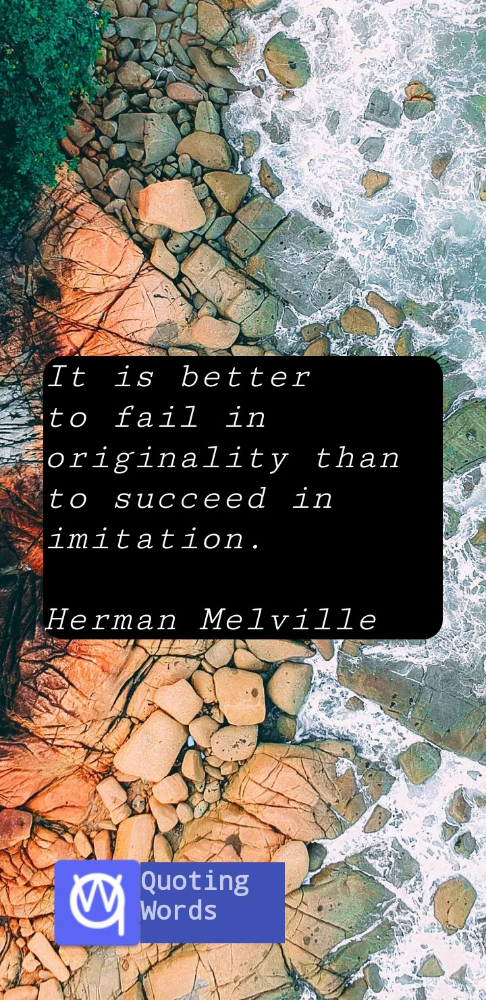
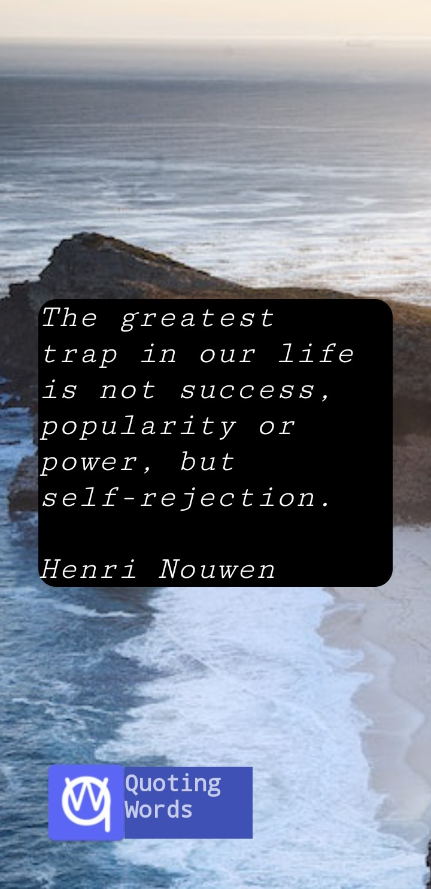
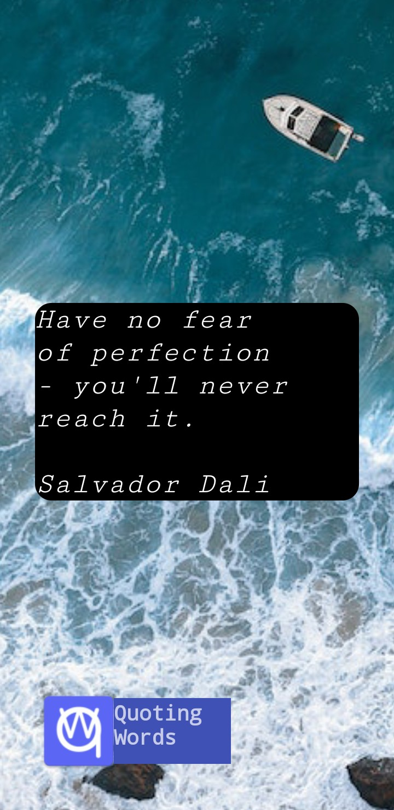

  <h1>Quoting-Words</h1>

  

  
An Android app that gives you random inspiring quotes with beautiful background

# Screenshots

  
  
  

# Features
- Simple design/Easy to use
- Over 50+ inspiring quotes
- Over 20+ quality images
- Background music (Coming soon)
# Download
Get the latest release of the app [here](https://github.com/Mini-Ware/Quoting-Words/releases)!
# Credits
Logo was created by [Mini-Ware](https://github.com/Mini-Ware). Images are free and taken from [Pexels](https://www.pexels.com/).
# License
This app is licenced under the [Apache License 2.0](https://github.com/Mini-Ware/Quoting-Words/blob/main/LICENSE)
